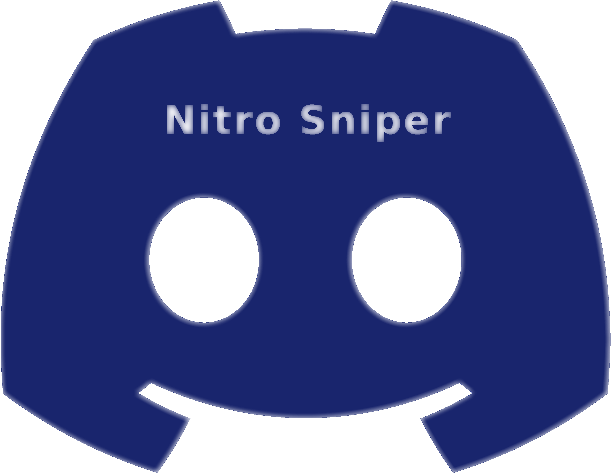

<div id="top"></div>
<!--
*** Thanks for checking out the Best-README-Template. If you have a suggestion
*** that would make this better, please fork the repo and create a pull request
*** or simply open an issue with the tag "enhancement".
*** Don't forget to give the project a star!
*** Thanks again! Now go create something AMAZING! :D
-->


<!-- PROJECT SHIELDS -->
<!--
*** I'm using markdown "reference style" links for readability.
*** Reference links are enclosed in brackets [ ] instead of parentheses ( ).
*** See the bottom of this document for the declaration of the reference variables
*** for contributors-url, forks-url, etc. This is an optional, concise syntax you may use.
*** https://www.markdownguide.org/basic-syntax/#reference-style-links
-->
[![Contributors][contributors-shield]][contributors-url]
[![Forks][forks-shield]][forks-url]
[![Stargazers][stars-shield]][stars-url]
[![Issues][issues-shield]][issues-url]
[![MIT License][license-shield]][license-url]


<!-- PROJECT LOGO -->
<br />
<div align="center">
  <a href="https://github.com/Obscurely/DiscordNitroSniper">
    
  </a>

  <h3 align="center">Discord Nitro Sniper</h3>

  <p align="center">
    Fast multi-threaded discord nitro sniper written in C# with dotnet 6 (as fast as GO or even faster at requests) using proxies from proxy scrape's API. Auto activates code on account after found.
    <br />
    <a href="https://github.com/Obscurely/DiscordNitroSniper"><strong>Explore the docs »</strong></a>
    <br />
    <br />
    <a href="https://github.com/Obscurely/DiscordNitroSniper">View Demo</a>
    ·
    <a href="https://github.com/Obscurely/DiscordNitroSniper/issues">Report Bug</a>
    ·
    <a href="https://github.com/Obscurely/DiscordNitroSniper/issues">Request Feature</a>
  </p>
</div>


<!-- TABLE OF CONTENTS -->
<details>
  <summary>Table of Contents</summary>
  <ol>
    <li>
      <a href="#about-the-project">About The Project</a>
      <ul>
        <li><a href="#built-with">Built With</a></li>
      </ul>
    </li>
    <li>
      <a href="#getting-started">Getting Started</a>
      <ul>
        <li><a href="#running-the-program">Running the Program</a></li>
        <li><a href="#compilation">Compilation</a></li>
      </ul>
    </li>
    <li><a href="#usage">Usage</a></li>
    <li><a href="#roadmap">Roadmap</a></li>
    <li><a href="#contributing">Contributing</a></li>
    <li><a href="#license">License</a></li>
    <li><a href="#contact">Contact</a></li>
    <li>
      <a href="#acknowledgments">Acknowledgments</a>
      <ul>
        <li><a href="#why-csharp-and-not-go-for-mass-http-requesting"> Why CSharp and not GO for Mass Http Requesting</a></li>
      </ul>
    </li>
  </ol>
</details>


## About The Project
Fast multi-threaded discord nitro sniper written in C# with dotnet 6 (as fast as GO or even faster at requests) using proxies from proxy scrape's API. Auto activates code on account after found. Rewrite of my old [Discord-Nitro-Sniper Repo](https://github.com/Obscurely/Discord-Nitro-Sniper/), old one was old and bad quite bad written since I was at start with API's client requests and c# in general.


### Built with
Only the stock libraries.
* [C# 10.0](https://docs.microsoft.com/en-us/dotnet/csharp/whats-new/csharp-10)
* [.NET 6](https://devblogs.microsoft.com/dotnet/announcing-net-6/?WT.mc_id=dotnet-35129-website)


## Getting Started

### Running The Program
1. Go to [Releases](https://github.com/Obscurely/DiscordNitroSniper/releases) tab and download latest stable binary for your platform, if your platform is not present refer to [Compilation](#compilation) and compile it for your platform.
2. Extract archive to a folder, wherever you want.
3. Open config.json with your favourite file editor of choice and edit the file to fit your computer and use.
```
{
  "user_token": "user_token",
  "threads_number": "threads_amount",
  "proxies_timeout_ms": "3000"
}
```
<div>Replace user_token value (right side) with your discord user token, refer to [how to get discord user token](#how-to-get-user-token) if you don't know how.</div>
<div>Replace "threads_amount" with how many threads you want to run this on, for me with a 16 threads cpu going past 2048 threads seem to slow down more than make it faster and going above 512 threads (maybe above less) would cause the router to run out of memory so test it yourself. Just don't do insance amount of threads, do like 4-8 times your cpu threads, meaning if you have a 16 threaded cpu you would use 64-128 threads. </div>
<div>Change the proxies timeout only if you hae a good reason to, 3000 seems to be the sweat spot from my testing. </div>

4. Open a new terminal/cmd window in the folder you extracted the program in, if you can't rightclick on the folder and open it there do: "cd {the path}" and you will get there.
5. From here, if you are on windows run:
```
.\DiscordNitroSniper.exe
```
If you are on any other OS run:
```
./DiscordNitroSniper
```
6. Now you are fully setup and all you need to do is wait and pray you will get lucky!

### Compilation
Any of [.NET 6 available platforms](https://github.com/dotnet/core/blob/main/release-notes/6.0/supported-os.md) (distributions like Arch aren't specified, but can still be run if you compile them for linux). For the next steps you will need to have [.NET 6 SDK](https://dotnet.microsoft.com/en-us/download/dotnet/6.0) installed

1. Clone this repo on your pc, you can use "git clone", if you have git installed, like this:
```
git clone https://github.com/Obscurely/DiscordNitroSniper/edit/master/README.md
```
Otherwise in the right up side of the repo page you will see a download button, download the repo as zip and extract it in a folder

2. Open a new terminal/cmd window in the folder you extracted the repo in, if you can't rightclick on the folder and open it there do: "cd {the path}" and you will get there.
3. From there run this compile command in the terminal:
```
dotnet publish --sc -r YOUR_RID -c Release
```
Where YOUR_RID should be replaced with the one corresponding to your platform, check [RID CATALOG](https://docs.microsoft.com/en-us/dotnet/core/rid-catalog), for example on linux you would use linux-x64 and on windows win-x64 or win10-x64.

4. Your build is gonna be in the folder DiscordNitroSniper/bin/Release/net6.0/YOUR_RID/publish where YOUR_RID, the rid you used above. From here refer to [Running The Program](#running-the-program).

## Usage
I do not recomend that you actually use this program to get nitro, even tho you can, because there is a chance you would get your account terminated. The purpose of this is to show an example and help you learn how to use HttpClient in C# to create mass requests with proxies as efficient and fast as possbile since C# is actually a great language for [scraping the web](https://www.parsehub.com/blog/what-is-web-scraping/), mass requesting a website for specific things, etc. Or even use this readme as an example if you want, or afterall to do whatever you want with this repo since it's under MIT license and I ain't goona stop you from doing whatever your heart desires.

## Roadmap
Nothing really. The project is in the state I wanted it, so it's probably not gonna get updated in the near feature at least.

## Contributing
Edit a file you want, do a [pull request](https://docs.github.com/en/pull-requests/collaborating-with-pull-requests/proposing-changes-to-your-work-with-pull-requests/creating-a-pull-request), I will look at it and if the change makes sense and is a good one I will accept it and that's it.

## License
Is under [MIT license](https://mit-license.org/) and I ain't gonna care whatever anyone does with the code, so stick to the license conditions and have fun :)

## Contact
Either post an issue in the [Issues Tab](https://github.com/Obscurely/DiscordNitroSniper/issues) or contact me at this email adddress if you have more to say:  obscurely.social@protonmail.com

## Acknowledgments

### Why CSharp and not GO for Mass Http Requesting
Written in C# instead of GO like people usually do for mass http requesting because from my testing dotnet 6 compared to latest GO version, by making a lot of requests, C# even proved faster than GO with 1ms on average, that's insignificant, but the point is it doesn't matter so I chose to go with C# since I like it more and is more optimized IMO for multi threading.

<!-- MARKDOWN LINKS & IMAGES -->
<!-- https://www.markdownguide.org/basic-syntax/#reference-style-links -->
[contributors-shield]: https://img.shields.io/github/contributors/Obscurely/DiscordNitroSniper.svg?style=for-the-badge
[contributors-url]: https://github.com/Obscurely/DiscordNitroSniper/graphs/contributors
[forks-shield]: https://img.shields.io/github/forks/Obscurely/DiscordNitroSniper.svg?style=for-the-badge
[forks-url]: https://github.com/Obscurely/DiscordNitroSniper/network/members
[stars-shield]: https://img.shields.io/github/stars/Obscurely/DiscordNitroSniper.svg?style=for-the-badge
[stars-url]: https://github.com/Obscurely/DiscordNitroSniper/stargazers
[issues-shield]: https://img.shields.io/github/issues/Obscurely/DiscordNitroSniper.svg?style=for-the-badge
[issues-url]: https://github.com/Obscurely/DiscordNitroSniper/issues
[license-shield]: https://img.shields.io/github/license/Obscurely/DiscordNitroSniper.svg?style=for-the-badge
[license-url]: https://github.com/Obscurely/DiscordNitroSniper/blob/master/LICENSE
[product-screenshot]: images/screenshot.png
